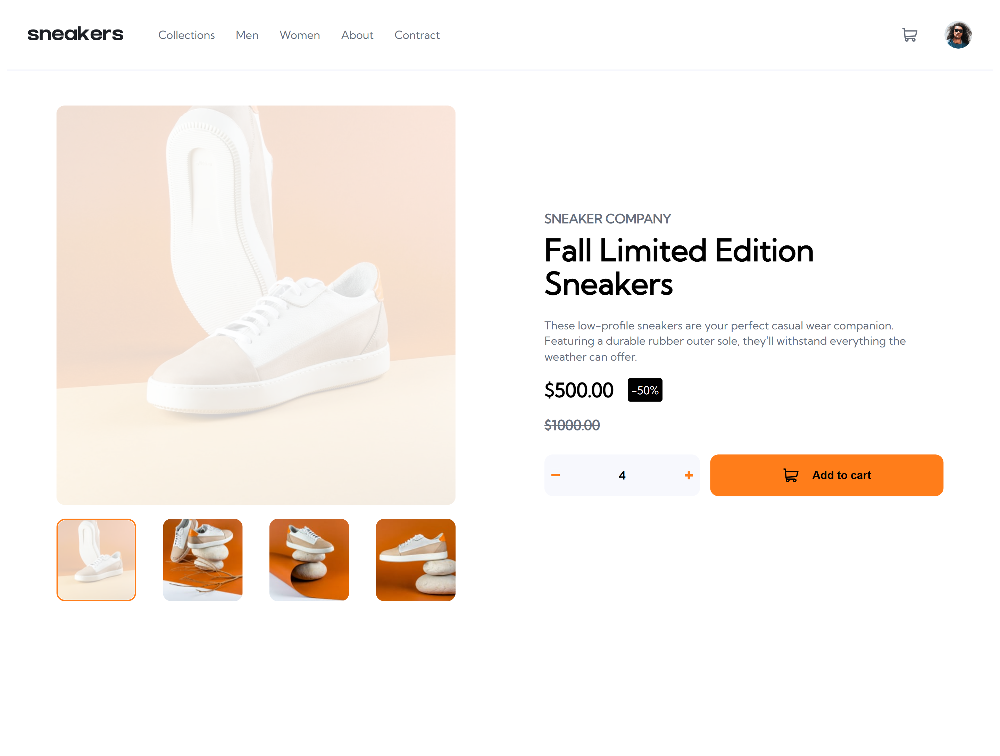

# Frontend Mentor - Todo app solution

This is a solution to the [Todo app challenge on Frontend Mentor](https://www.frontendmentor.io/challenges/ecommerce-product-page-UPsZ9MJp6). Frontend Mentor challenges help you improve your coding skills by building realistic projects.

## Table of contents

- [Overview](#overview)
  - [The challenge](#the-challenge)
  - [Screenshot](#screenshot)
  - [Links](#links)
- [My process](#my-process)
  - [Built with](#built-with)
  - [What I learned](#what-i-learned)
  - [Continued development](#continued-development)
  - [Useful resources](#useful-resources)
- [Author](#author)

## Overview

### The challenge

Users should be able to:

- View the optimal layout for the site depending on their device's screen size
- See hover states for all interactive elements on the page
- Open a lightbox gallery by clicking on the large product image
- Switch the large product image by clicking on the small thumbnail images
- Add items to the cart
- View the cart and remove items from it

### Screenshot

### Links

- Solution URL: [solution URL here]()
- Live Site URL: [live site URL here](https://sneakers-product-page-react-f8xec0vx0-andrei-pavlovs-projects.vercel.app/)

## My process

### Built with

- Semantic HTML5
- CSS custom properties
- Flexbox & CSS Grid
- [React](https://reactjs.org/)
- [Vite](https://vitejs.dev/)
- TypeScript
- React Context + custom hooks
- Drag-and-drop logic via native events

### What I learned

- How to structure scalable React apps using separation of concerns and hooks.
- How to use `Context API` for centralized state management.
- How to implement some animations and modal-windows.
- How to toggle a sidebar.

### Continued development

## In the future I’d like to:

- Add animations to the drag-and-drop actions
- Add unit and integration tests (e.g. with Testing Library)
- Add user authentication and backend persistence (Firebase/Supabase)
- Make the app accessible (ARIA, keyboard drag support, etc.)

## Useful resources

- React Docs — the go-to for working with hooks and context
- TypeScript Docs
- framer-motion library

## Author

Frontend Mentor - [@frontend-mentor](https://www.frontendmentor.io/profile/PavAndrei)
GitHub -[@github](https://github.com/PavAndrei)
